# Pokédex App
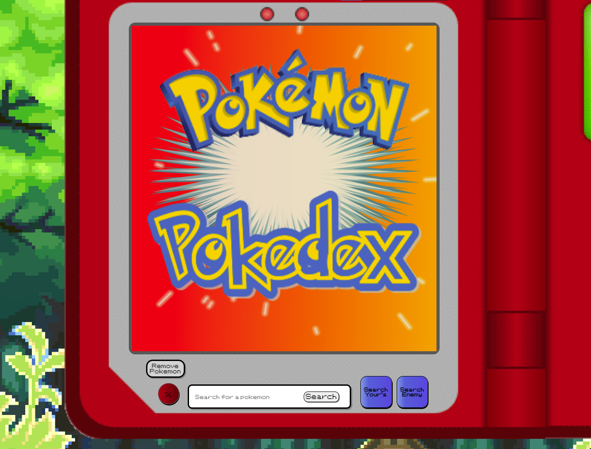

You have now entered the repository of an amazing app: **The Pokédex App.** This Pokédex App was made by three amazing developers: [Elias Gutierrez](https://github.com/BlackCubes), [Jorge Villalobos](https://github.com/JorgeLVilla), and [Luis Perez](https://github.com/Lap343). If you have even the slightest interest in Pokémon, you are going to love this.

Imagine this scenario: You are playing a Pokémon game, and you know gym leader Brock is up next. You know that his Pokémon of choice are Geodude and Onix, and all you have is a Squirtle. Well, with this app you can check the type matchups of your Pokémon vs. any other Pokémon. Using this app you would find out that both of Brock's Pokémon are weak against Grass and/or Water Type Pokémon. You can also just search random Pokémon to see their stats, and the app will show you how that Pokémon would hold up against another Pokémon. With over 900 Pokémon in the [Pokémon API](https://pokeapi.co/) database, the combinations are almost endless.

---
## Pokédex App Features
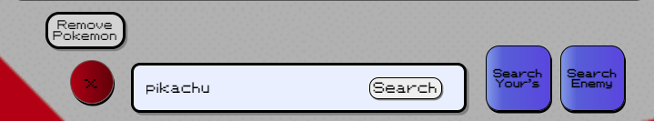
When loading the Pokédex app for the first time, a small opening animation will play showing you the main splash screen and the search bar (the image above). In the search bar, type the Pokémon you want to learn more about. After pressing the search button, the main screen will change to the **Single Pokémon Searched Screen** (the image below).

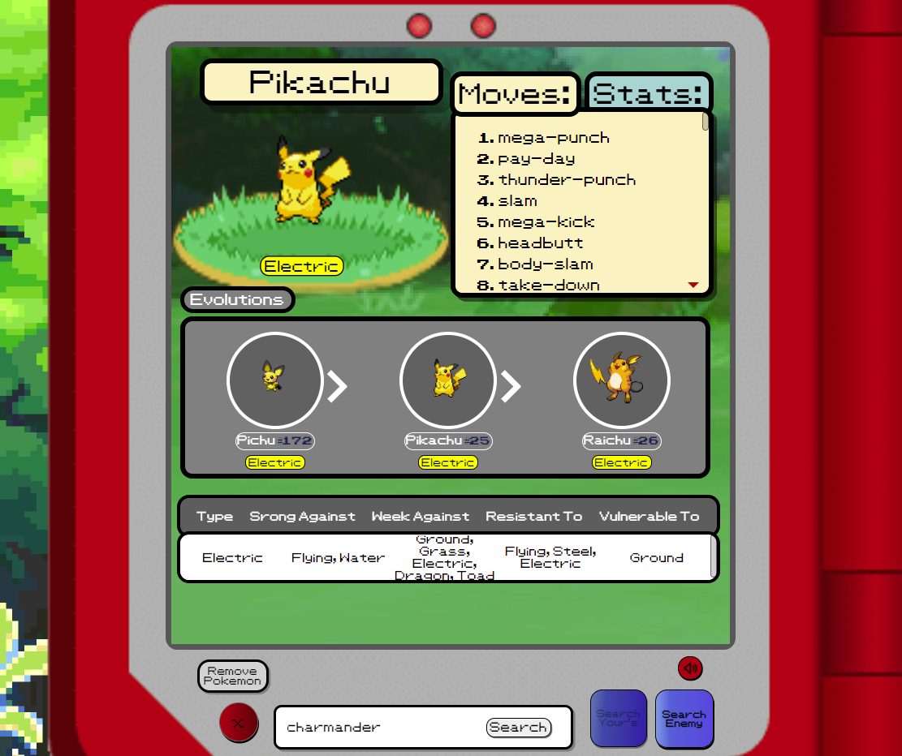

In this **Single Pokémon Searched Screen**, you will find a range of information. After the Pokéball loading animation, the searched Pokémon's cry will play, and a rendition of the route 1 song from *Pokémon Red/Blue* will play. If you would like to go on using this app without hearing any music, please press the small red mute button on the lower right side of the screen (the image below).
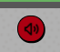

#### One Pokémon Searched Screen
The **Single Pokémon Searched Screen** has three distinct sections broken up into thirds on the screen.

##### Pokémon moves and base stats
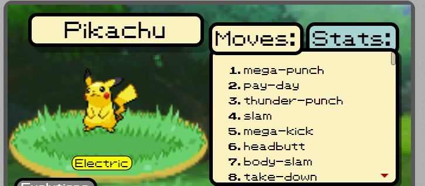
In this section of the main screen you will see the Pokémon's image and name hovering above them to the left. On the right you will see their moves and base stats. When everything is done loading, the moves tab will show up by default. However, if you'd like to see the Pokemon's stats instead, you can also click on the tab to the right of moves, and it will display their stats.

##### Pokémon's Evolutions
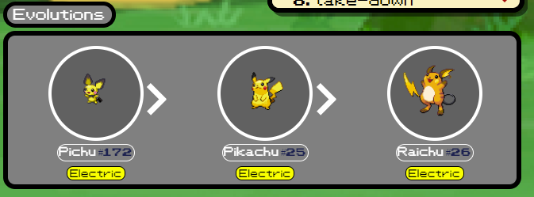
This section has the Pokemon's evolution tree. If the Pokémon does not have one, then it will be shown by itself. If the Pokémon does have an evolution tree, you will see the correct order in which the evolutions would happen. Also, all Pokémon images are clickable to bring that Pokémon's information to the main screen if you happen to choose a different Pokémon.

##### Pokémon's Type Weaknesses/Strengths Chart
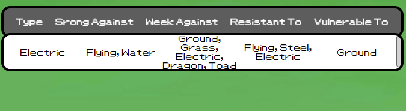
This sections shows the Pokémon's type(s) and the types the Pokemon is strong against, weak against, resistant to, and vulnerable to. If the main Pokémon has more than one type, the chart will expand to show the extra type and its type matchup.

---
#### Search for Combatant Pokémon
Before pressing the search button, type in the name of the Combatant Pokémon in the search bar, and then press the Search Enemy button (seen in the image below)..
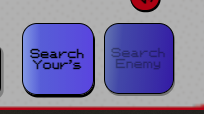
It will toggle the search button to search for a Combatant Pokémon for the initial Pokémon's stats to be compared against each other. After that, press search and the main screen will display the **VS. Pokemon Search Screen**.

##### VS. Pokémon Search Screen
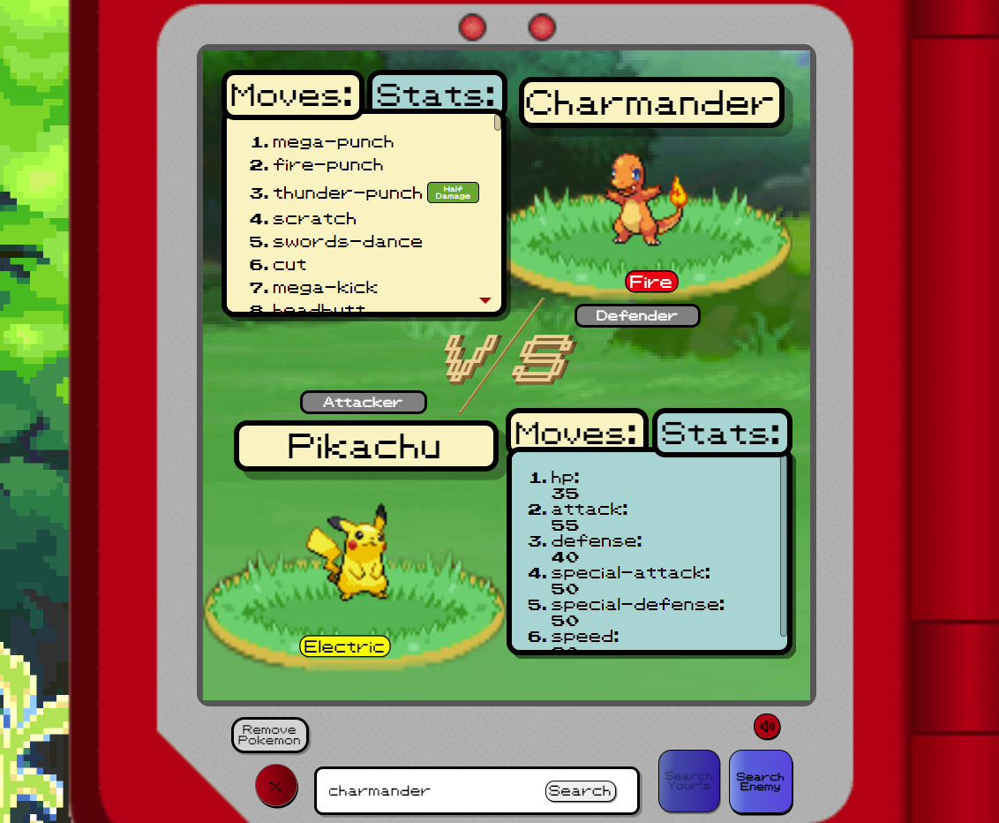
First, you will see a snazzy looking VS. animation with the Pokémon battle theme music playing. Then, your first searched Pokémon will be set to the bottom, and the second searched Pokémon will be set to the top of the main screen. Both Pokémon will have their types, moves, and base stats on display so you can compare them (seen in the image above).

Something the app compares for you is the Pokémon's overall type advantage/disadvantage.

If your Pokémon's type(s) is very effective against the other Pokémon, you will see the Super Effective badge show up (seen in the image below).
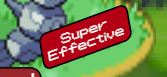 
If your Pokémon's type(s) has no effect on the other Pokémon, you will see the Ineffective badge show up (seen in the image below).
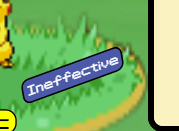
If your Pokémon's type(s) has little effect on the other Pokémon, you will see the Half Damage badge show up  (seen in the image below).

Another cool feature this app has is if you click on one of the moves, the other Pokémon's health bar will go down depending on its health minus the damage done by the clicked on move (seen in the image below).
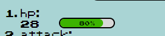

#### Going a page back or Changing a Pokémon
To go to the previous page visited please hit the Remove Pokémon button. (seen in the image below)
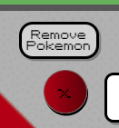

---
## Running on you local machine
What you need
1. Computer terminal
2. internet
3. node updated to version 14.15.4
4. npm updated to version 7.19.1
5. brain

To run this app locally, open a terminal and run
`git clone https://github.com/Lap343/poke-app.git`
to clone the repo on a local machine.

Then
`cd poke-app`
and then
`cd pokemon-app`
and after that
`npm install`
and finally, after all those installs are done
`npm start`

## Deployment Instructions
Install Firebase CLI by `running npm install -g firebase-tools`

Create project on Firebase console

In project's root directory, login via `firebase login` command

Initialize Firebase project via `firebase init`

Create build by runing `npm run build`

Run `firebase deploy`

For more info about hosting with Firebase, check out the [official Firebase documentation](https://firebase.google.com/docs/hosting/quickstart)